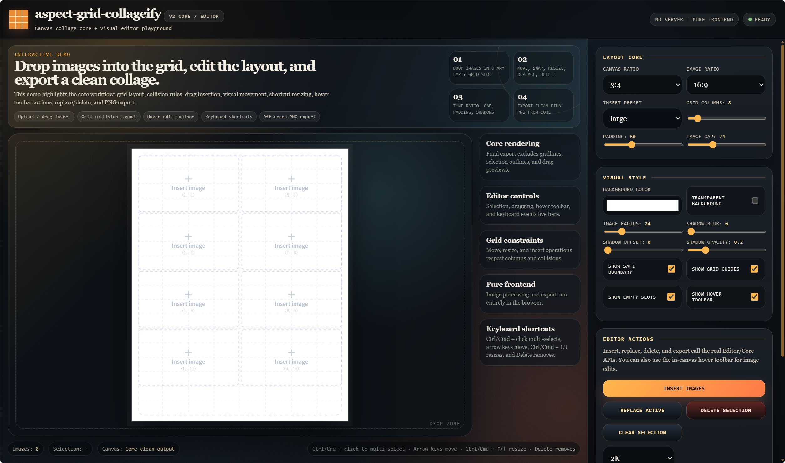

# aspect-grid-collageify

<p align="center">
  <a href="https://www.npmjs.com/package/aspect-grid-collageify"></a>
  <a href="https://www.npmjs.com/package/aspect-grid-collageify"></a>
  <a href="https://bundlephobia.com/package/aspect-grid-collageify"></a>
  
  
  
  <a href="./LICENSE"></a>
</p>

English | [简体中文](./README.md)

`Aspect-grid-collageify` is a lightweight, pure frontend Canvas collage library. It provides two layers of functionality:

- `CollageCore`: a headless collage core for state, grid layout, collision checks, image mutations, final rendering, and export.
- `CanvasCollageEditor`: a visual editor built on `CollageCore`, responsible for canvas interactions, selection, drag move, drag insert, keyboard shortcuts, and editor overlays.

Core output is always the clean final collage. Editor UI such as gridlines, placeholders, selection outlines, and drag previews only belongs to Editor and is never included in exported images.

## 📖 Table of Contents

- [aspect-grid-collageify](#aspect-grid-collageify)
  - [📖 Table of Contents](#-table-of-contents)
  - [✨ Features](#-features)
  - [🌐 Live Demo](#-live-demo)
  - [📦 Installation](#-installation)
  - [🚀 Imports](#-imports)
  - [🖼️ Quick Start: Headless Collage Export](#️-quick-start-headless-collage-export)
  - [🎛️ Quick Start: Visual Editor](#️-quick-start-visual-editor)
    - [⌨️ Keyboard Shortcuts](#️-keyboard-shortcuts)
  - [⚙️ Configuration Example](#️-configuration-example)
  - [📚 API](#-api)
    - [`CollageCore`](#collagecore)
      - [Constructor](#constructor)
      - [State API](#state-api)
      - [Geometry API](#geometry-api)
      - [Image and Layout API](#image-and-layout-api)
      - [Rendering and Export API](#rendering-and-export-api)
    - [`CanvasCollageEditor`](#canvascollageeditor)
      - [Constructor](#constructor-1)
      - [Base API](#base-api)
      - [Selection API](#selection-api)
      - [Input and File API](#input-and-file-api)
      - [Event API](#event-api)
    - [Type API](#type-api)
      - [Basic Types](#basic-types)
      - [Options and Image Types](#options-and-image-types)
      - [Layout and Operation Types](#layout-and-operation-types)
  - [🛠️ Local Development](#️-local-development)
  - [🗂️ Project Structure](#️-project-structure)
  - [📄 License](#-license)

## ✨ Features

- 🎨 Pure frontend Canvas rendering with no server dependency.
- 🖼️ Offscreen PNG / Blob export.
- 📐 Custom container ratio, image ratio, grid columns, padding, and gap.
- ✨ Transparent background, image border radius, and image shadows.
- 🧩 Grid-based insert, move, resize, swap, remove, and replace operations.
- 🕹️ Visual editing: click slot to upload, drag files to insert, drag move, drag swap, multi-select, and keyboard actions.
- 🧠 Full TypeScript type exports.
- 📦 Multiple package entry points, so you can import only Core or use the visual Editor.

## 🌐 Live Demo

Want to try the visual editor before installing? 👉 [Open the Live](https://liuxin2533.github.io/aspect-grid-collageify/)

The demo showcases the core editor workflows, including image upload, drag move, drag insert, swap, resize, remove, replace, and final export. It is a quick way to check whether the library fits your use case before adding it to a project.



## 📦 Installation

```bash
npm install aspect-grid-collageify
```

```bash
pnpm add aspect-grid-collageify
```

```bash
yarn add aspect-grid-collageify
```

## 🚀 Imports

Recommended capability-based imports:

```typescript
import { CollageCore } from "aspect-grid-collageify/core";
import { CanvasCollageEditor } from "aspect-grid-collageify/editor";
```

You can also import from the root entry:

```typescript
import { CollageCore, CanvasCollageEditor } from "aspect-grid-collageify";
```

| Entry                           | Exports                                                | Description                                                  |
| ------------------------------- | ------------------------------------------------------ | ------------------------------------------------------------ |
| `aspect-grid-collageify`        | `CollageCore`, `CanvasCollageEditor`, all public types | Root entry.                                                  |
| `aspect-grid-collageify/core`   | `CollageCore`                                          | Use this for headless rendering and base collage operations. |
| `aspect-grid-collageify/editor` | `CanvasCollageEditor`                                  | Use this when you need canvas visual editing.                |

## 🖼️ Quick Start: Headless Collage Export

```typescript
import { CollageCore } from "aspect-grid-collageify/core";

const core = new CollageCore({
  containerRatio: "3:4",
  imageRatio: "16:9",
  gridColumns: 8,
  padding2K: 60,
  gap2K: 24,
  background: {
    color: "#ffffff",
    transparent: false,
  },
  imageStyle: {
    borderRadius2K: 24,
    shadowBlur2K: 12,
    shadowOffset2K: 8,
    shadowOpacity: 0.2,
  },
  images: [
    {
      id: "image-1",
      src: "/images/a.jpg",
      name: "A",
      gridX: 0,
      gridY: 0,
      span: 4,
    },
    {
      id: "image-2",
      src: "/images/b.jpg",
      name: "B",
      gridX: 4,
      gridY: 0,
      span: 4,
    },
  ],
});

const dataUrl = await core.exportPNG(2048);
```

## 🎛️ Quick Start: Visual Editor

```typescript
import { CollageCore } from "aspect-grid-collageify/core";
import { CanvasCollageEditor } from "aspect-grid-collageify/editor";

const canvas = document.querySelector("canvas")!;

const core = new CollageCore({
  containerRatio: "3:4",
  imageRatio: "16:9",
  gridColumns: 8,
  padding2K: 60,
  gap2K: 24,
  images: [],
});

const editor = new CanvasCollageEditor(canvas, core, {
  multiSelect: true,
  keyboard: true,
  dragMove: true,
  dragSwap: true,
  dragInsert: true,
  quickReplace: true,
});

editor.on("change", (images) => {
  console.log("images changed", images);
});

editor.on("cellclick", (placement) => {
  // The application can open a file picker, then call editor.insertFiles(files).
  editor.setPendingInsertPlacement(placement);
});
```

Convenience construction is also available:

```typescript
const editor = CanvasCollageEditor.create(canvas, options, editorOptions);
const core = editor.core;
```

### ⌨️ Keyboard Shortcuts

The visual editor includes a small set of built-in keyboard shortcuts. When `keyboard: true` is enabled, the canvas is made focusable automatically, so users can select images and then move, resize, or delete them from the keyboard.

| Shortcut                   | Action                          | Notes                                                     |
| -------------------------- | ------------------------------- | --------------------------------------------------------- |
| `Ctrl / Cmd + click image` | Multi-select / toggle selection | Requires `multiSelect: true`.                             |
| `↑` / `↓` / `←` / `→`      | Move selected images            | Moves the current selection by one grid step.             |
| `Ctrl / Cmd + ↑`           | Shrink selected images          | Decreases the selected image span by 1.                   |
| `Ctrl / Cmd + ↓`           | Enlarge selected images         | Increases the selected image span by 1.                   |
| `Delete` / `Backspace`     | Delete selected images          | Removes the current selection and clears selection state. |

## ⚙️ Configuration Example

```typescript
const options = {
  containerRatio: "3:4",
  imageRatio: "16:9",
  gridColumns: 12,
  padding2K: 60,
  gap2K: 24,
  background: {
    color: "#ffffff",
    transparent: false,
  },
  imageStyle: {
    borderRadius2K: 24,
    shadowBlur2K: 12,
    shadowOffset2K: 8,
    shadowOpacity: 0.2,
  },
  placementPreset: "medium",
  images: [],
};
```

## 📚 API

### `CollageCore`

`CollageCore` is the core for collage state and final rendering. It does not bind DOM events, does not maintain selection, and does not draw editor overlays.

#### Constructor

| API                        | Location                      | Parameters                | Return        | Description                                                         |
| -------------------------- | ----------------------------- | ------------------------- | ------------- | ------------------------------------------------------------------- |
| `new CollageCore(options)` | `aspect-grid-collageify/core` | `options: CollageOptions` | `CollageCore` | Creates a collage core instance and initializes options and images. |

#### State API

| API                      | Location      | Parameters                                                            | Return           | Description                                                                         |
| ------------------------ | ------------- | --------------------------------------------------------------------- | ---------------- | ----------------------------------------------------------------------------------- |
| `getOptions()`           | `CollageCore` | None                                                                  | `CollageOptions` | Gets the current collage options.                                                   |
| `setOptions(options)`    | `CollageCore` | `options: CollageOptions`                                             | `void`           | Replaces all options and emits a change event.                                      |
| `updateOptions(options)` | `CollageCore` | `options: Partial<CollageOptions>`                                    | `void`           | Merges partial options and emits a change event.                                    |
| `getImages()`            | `CollageCore` | None                                                                  | `CollageImage[]` | Gets the current image list.                                                        |
| `setImages(images)`      | `CollageCore` | `images: CollageImage[]`                                              | `void`           | Replaces the image list; positions are normalized against the current grid columns. |
| `onChange(callback)`     | `CollageCore` | `callback: (images: CollageImage[], options: CollageOptions) => void` | `Unsubscribe`    | Listens for option or image changes. Returns an unsubscribe function.               |
| `destroy()`              | `CollageCore` | None                                                                  | `void`           | Clears listeners and image cache.                                                   |

#### Geometry API

| API                                         | Location      | Parameters                                                             | Return                  | Description                                                                   |
| ------------------------------------------- | ------------- | ---------------------------------------------------------------------- | ----------------------- | ----------------------------------------------------------------------------- |
| `getLayout(width, height)`                  | `CollageCore` | `width: number`, `height: number`                                      | `CollageLayout`         | Calculates layout from viewport size and current options.                     |
| `toGridPoint(point, viewport)`              | `CollageCore` | `point: GridPoint`, `viewport: DrawViewport`                           | `GridPoint`             | Converts a canvas point to a grid point.                                      |
| `getImageRect(imageOrId, layout)`           | `CollageCore` | `imageOrId: CollageImage \| string`, `layout: CollageLayout`           | `ImageRect \| null`     | Gets the canvas rectangle for an image.                                       |
| `hitTest(point, viewport)`                  | `CollageCore` | `point: GridPoint`, `viewport: DrawViewport`                           | `CollageImage \| null`  | Finds the image hit by a canvas point.                                        |
| `getPlacementSpan(preset?)`                 | `CollageCore` | `preset?: PlacementPreset`                                             | `number`                | Calculates insert span from current grid columns and preset.                  |
| `findSlots(options)`                        | `CollageCore` | `options: FindSlotsOptions`                                            | `GridPlacement[]`       | Finds empty slots where an image can be placed.                               |
| `findFirstSlot(options)`                    | `CollageCore` | `options: FindSlotsOptions`                                            | `GridPlacement \| null` | Finds the first available empty slot.                                         |
| `canPlace(placement, gridRows, ignoreIds?)` | `CollageCore` | `placement: GridPlacement`, `gridRows: number`, `ignoreIds?: string[]` | `boolean`               | Checks whether a placement is valid, optionally ignoring specified image ids. |

#### Image and Layout API

| API                                               | Location      | Parameters                                                      | Return           | Description                                                                       |
| ------------------------------------------------- | ------------- | --------------------------------------------------------------- | ---------------- | --------------------------------------------------------------------------------- |
| `insertImage(image)`                              | `CollageCore` | `image: CollageImage`                                           | `CollageImage`   | Inserts a complete image object. Caller provides id, src, gridX, gridY, and span. |
| `insertImageAt(input, placement)`                 | `CollageCore` | `input: ImageInput`, `placement: GridPlacement`                 | `CollageImage`   | Creates and inserts an image from input and explicit placement.                   |
| `insertImages(inputs, options)`                   | `CollageCore` | `inputs: ImageInput[]`, `options: InsertImagesOptions`          | `CollageImage[]` | Inserts multiple images and automatically places them into available slots.       |
| `updateImage(id, patch)`                          | `CollageCore` | `id: string`, `patch: Partial<CollageImage>`                    | `boolean`        | Updates an image. Returns `true` on success.                                      |
| `removeImage(id)`                                 | `CollageCore` | `id: string`                                                    | `boolean`        | Removes one image. Returns `true` on success.                                     |
| `removeImages(ids)`                               | `CollageCore` | `ids: string[]`                                                 | `boolean`        | Removes multiple images. Returns `true` on success.                               |
| `replaceImage(id, input)`                         | `CollageCore` | `id: string`, `input: ImageInput`                               | `boolean`        | Replaces image src, name, and style.                                              |
| `moveImage(id, target, gridRows)`                 | `CollageCore` | `id: string`, `target: GridPoint`, `gridRows: number`           | `boolean`        | Moves one image to a grid point.                                                  |
| `moveImages(ids, delta, gridRows)`                | `CollageCore` | `ids: string[]`, `delta: GridPoint`, `gridRows: number`         | `boolean`        | Moves multiple images by a grid delta.                                            |
| `moveImagesByDirection(ids, direction, gridRows)` | `CollageCore` | `ids: string[]`, `direction: MoveDirection`, `gridRows: number` | `boolean`        | Moves multiple images by direction.                                               |
| `resizeImage(id, delta, gridRows)`                | `CollageCore` | `id: string`, `delta: number`, `gridRows: number`               | `boolean`        | Changes one image span.                                                           |
| `resizeImages(ids, delta, gridRows)`              | `CollageCore` | `ids: string[]`, `delta: number`, `gridRows: number`            | `boolean`        | Changes multiple image spans.                                                     |
| `swapImages(sourceId, targetId)`                  | `CollageCore` | `sourceId: string`, `targetId: string`                          | `boolean`        | Swaps placement and span between two images.                                      |
| `pushBelow(id, rows, gridRows)`                   | `CollageCore` | `id: string`, `rows: number`, `gridRows: number`                | `boolean`        | Pushes images below the specified image downward.                                 |
| `pullBelow(id, rows?)`                            | `CollageCore` | `id: string`, `rows?: number`                                   | `boolean`        | Pulls images below the specified image upward.                                    |

#### Rendering and Export API

| API                                   | Location      | Parameters                                                | Return                       | Description                                                                        |
| ------------------------------------- | ------------- | --------------------------------------------------------- | ---------------------------- | ---------------------------------------------------------------------------------- |
| `draw(ctx, viewport)`                 | `CollageCore` | `ctx: CanvasRenderingContext2D`, `viewport: DrawViewport` | `void`                       | Draws the final collage to a canvas context.                                       |
| `renderToCanvas(width?)`              | `CollageCore` | `width?: number`                                          | `Promise<HTMLCanvasElement>` | Renders offscreen and returns a canvas. Height is calculated from container ratio. |
| `exportPNG(width?)`                   | `CollageCore` | `width?: number`                                          | `Promise<string>`            | Exports a PNG Data URL.                                                            |
| `exportBlob(width?, type?, quality?)` | `CollageCore` | `width?: number`, `type?: string`, `quality?: number`     | `Promise<Blob>`              | Exports a Blob. Supports PNG, JPEG, WebP, and other canvas-supported types.        |
| `getImageLoader()`                    | `CollageCore` | None                                                      | `ImageLoader`                | Gets the internal image loader. Usually only needed for advanced use cases.        |

### `CanvasCollageEditor`

`CanvasCollageEditor` is a canvas visual editing engine. It reads and writes collage state through `core`, and maintains selection, active image, drag state, and editor overlays.

#### Constructor

| API                                                           | Location                        | Parameters                                                                                           | Return                | Description                                                                      |
| ------------------------------------------------------------- | ------------------------------- | ---------------------------------------------------------------------------------------------------- | --------------------- | -------------------------------------------------------------------------------- |
| `new CanvasCollageEditor(canvas, core, options?)`             | `aspect-grid-collageify/editor` | `canvas: HTMLCanvasElement`, `core: CollageCore`, `options?: CanvasCollageEditorOptions`             | `CanvasCollageEditor` | Creates a visual editor from an existing Core instance.                          |
| `CanvasCollageEditor.create(canvas, options, editorOptions?)` | `CanvasCollageEditor`           | `canvas: HTMLCanvasElement`, `options: CollageOptions`, `editorOptions?: CanvasCollageEditorOptions` | `CanvasCollageEditor` | Convenience constructor. Creates `CollageCore` internally and returns an editor. |

#### Base API

| API         | Location              | Parameters | Return        | Description                                                             |
| ----------- | --------------------- | ---------- | ------------- | ----------------------------------------------------------------------- |
| `core`      | `CanvasCollageEditor` | None       | `CollageCore` | The underlying Core instance.                                           |
| `getCore()` | `CanvasCollageEditor` | None       | `CollageCore` | Gets the underlying Core instance.                                      |
| `render()`  | `CanvasCollageEditor` | None       | `void`        | Redraws the final collage and editor overlays.                          |
| `resize()`  | `CanvasCollageEditor` | None       | `void`        | Re-renders using the current canvas size.                               |
| `destroy()` | `CanvasCollageEditor` | None       | `void`        | Removes event listeners and releases Object URLs created by the editor. |

#### Selection API

| API                 | Location              | Parameters           | Return           | Description                                       |
| ------------------- | --------------------- | -------------------- | ---------------- | ------------------------------------------------- |
| `getSelection()`    | `CanvasCollageEditor` | None                 | `string[]`       | Gets selected image ids.                          |
| `setSelection(ids)` | `CanvasCollageEditor` | `ids: string[]`      | `void`           | Sets selected image ids. Invalid ids are ignored. |
| `getActiveId()`     | `CanvasCollageEditor` | None                 | `string \| null` | Gets the active image id.                         |
| `setActiveId(id)`   | `CanvasCollageEditor` | `id: string \| null` | `void`           | Sets the active image and synchronizes selection. |
| `clearSelection()`  | `CanvasCollageEditor` | None                 | `void`           | Clears selection and active image.                |

#### Input and File API

| API                                    | Location              | Parameters                                                            | Return                    | Description                                                                                    |
| -------------------------------------- | --------------------- | --------------------------------------------------------------------- | ------------------------- | ---------------------------------------------------------------------------------------------- |
| `handleKeyDown(event)`                 | `CanvasCollageEditor` | `event: KeyboardEvent`                                                | `boolean`                 | Handles delete, directional movement, and shortcut resize operations.                          |
| `insertFiles(files, options?)`         | `CanvasCollageEditor` | `files: FileList \| File[]`, `options?: Partial<InsertImagesOptions>` | `Promise<CollageImage[]>` | Resolves and inserts files. If a pending placement exists, it is used first.                   |
| `insertFilesAt(files, point)`          | `CanvasCollageEditor` | `files: FileList \| File[]`, `point: GridPoint`                       | `Promise<CollageImage[]>` | Inserts files by canvas point. It prefers a hit empty slot, then falls back to grid placement. |
| `replaceActiveFile(file)`              | `CanvasCollageEditor` | `file: File`                                                          | `Promise<boolean>`        | Replaces the active image with a file.                                                         |
| `replaceFile(id, file)`                | `CanvasCollageEditor` | `id: string`, `file: File`                                            | `Promise<boolean>`        | Replaces the specified image with a file.                                                      |
| `setPendingInsertPlacement(placement)` | `CanvasCollageEditor` | `placement: GridPlacement \| null`                                    | `void`                    | Sets the preferred placement for the next `insertFiles()` call.                                |

#### Event API

| API                               | Location              | Parameters                                     | Return        | Description                                                              |
| --------------------------------- | --------------------- | ---------------------------------------------- | ------------- | ------------------------------------------------------------------------ |
| `on("change", callback)`          | `CanvasCollageEditor` | `callback: (images: CollageImage[]) => void`   | `Unsubscribe` | Fires after Core changes and the editor re-renders.                      |
| `on("selectionchange", callback)` | `CanvasCollageEditor` | `callback: (ids: string[]) => void`            | `Unsubscribe` | Fires when selection changes.                                            |
| `on("activechange", callback)`    | `CanvasCollageEditor` | `callback: (id: string \| null) => void`       | `Unsubscribe` | Fires when the active image changes.                                     |
| `on("cellclick", callback)`       | `CanvasCollageEditor` | `callback: (placement: GridPlacement) => void` | `Unsubscribe` | Fires when an empty slot is clicked.                                     |
| `on("replacerequest", callback)`  | `CanvasCollageEditor` | `callback: (id: string) => void`               | `Unsubscribe` | Fires when an image is double-clicked for replacement.                   |
| `on("error", callback)`           | `CanvasCollageEditor` | `callback: (error: unknown) => void`           | `Unsubscribe` | Fires on async errors such as file resolving or drag insertion failures. |

### Type API

#### Basic Types

| Type              | Location                 | Fields / Parameters                                                 | Description                                           |
| ----------------- | ------------------------ | ------------------------------------------------------------------- | ----------------------------------------------------- |
| `RatioOption`     | `aspect-grid-collageify` | `"1:1" \| "3:4" \| "4:3" \| "16:9" \| "9:16" \| "custom" \| string` | Ratio option. Plain strings should use `w:h` format.  |
| `PlacementPreset` | `aspect-grid-collageify` | `"small" \| "medium" \| "large"`                                    | Size preset for automatic image insertion.            |
| `MoveDirection`   | `aspect-grid-collageify` | `"up" \| "down" \| "left" \| "right"`                               | Direction enum for movement.                          |
| `GridPoint`       | `aspect-grid-collageify` | `{ x: number; y: number }`                                          | Grid point or canvas point, depending on API context. |
| `GridPlacement`   | `aspect-grid-collageify` | `{ gridX: number; gridY: number; span: number }`                    | Image placement in the grid.                          |
| `ViewportSize`    | `aspect-grid-collageify` | `{ width: number; height: number }`                                 | Viewport size.                                        |
| `DrawViewport`    | `aspect-grid-collageify` | `{ width: number; height: number }`                                 | Draw viewport size.                                   |
| `Unsubscribe`     | `aspect-grid-collageify` | `() => void`                                                        | Unsubscribe function.                                 |

#### Options and Image Types

| Type                | Location                 | Fields / Parameters                                                                                                              | Description                                                               |
| ------------------- | ------------------------ | -------------------------------------------------------------------------------------------------------------------------------- | ------------------------------------------------------------------------- |
| `ImageStyleOptions` | `aspect-grid-collageify` | `borderRadius2K?: number`, `shadowBlur2K?: number`, `shadowOffset2K?: number`, `shadowOpacity?: number`                          | Image style options. Numeric values are scaled from a 2K canvas baseline. |
| `CollageImage`      | `aspect-grid-collageify` | `id: string`, `src: string`, `name: string`, `gridX: number`, `gridY: number`, `span: number`, `ImageStyleOptions`               | Image model in the collage.                                               |
| `ImageInput`        | `aspect-grid-collageify` | `id?: string`, `src: string`, `name?: string`, `style?: ImageStyleOptions`                                                       | Input model for inserting or replacing images.                            |
| `CollageOptions`    | `aspect-grid-collageify` | `containerRatio`, `imageRatio`, `gridColumns`, `padding2K`, `gap2K`, `background?`, `imageStyle?`, `images?`, `placementPreset?` | Core collage options.                                                     |

#### Layout and Operation Types

| Type                         | Location                        | Fields / Parameters                                                                                                                           | Description                                       |
| ---------------------------- | ------------------------------- | --------------------------------------------------------------------------------------------------------------------------------------------- | ------------------------------------------------- |
| `CollageLayout`              | `aspect-grid-collageify`        | `scale`, `padding`, `gap`, `cellW`, `cellH`, `gridRows`, `offsetX`, `offsetY`, `gridW`, `gridH`, `containerRatioVal`, `imageRatioVal`         | Layout data calculated from options and viewport. |
| `ImageRect`                  | `aspect-grid-collageify`        | `{ x: number; y: number; w: number; h: number }`                                                                                              | Image rectangle in canvas coordinates.            |
| `FindSlotsOptions`           | `aspect-grid-collageify`        | `{ span: number; gridRows: number }`                                                                                                          | Options for finding empty slots.                  |
| `InsertImagesOptions`        | `aspect-grid-collageify`        | `{ span?: number; placementPreset?: PlacementPreset; gridRows: number }`                                                                      | Options for batch image insertion.                |
| `CanvasCollageEditorOptions` | `aspect-grid-collageify/editor` | `multiSelect?`, `keyboard?`, `dragMove?`, `dragSwap?`, `dragInsert?`, `quickReplace?`, `preventDefaultFileDrop?`, `fileResolver?`, `overlay?` | Editor interaction options.                       |
| `EditorOverlayOptions`       | `aspect-grid-collageify`        | `showBoundary?`, `showGridlines?`, `showSlots?`, `slotText?`                                                                                  | Editor overlay display options.                   |

## 🛠️ Local Development

```bash
pnpm install
pnpm dev
```

Open the demo page to test canvas visual editing.

Build package outputs:

```bash
pnpm build
```

The build outputs ESM, CommonJS, and type declarations for these package entries:

```text
aspect-grid-collageify
aspect-grid-collageify/core
aspect-grid-collageify/editor
```

## 🗂️ Project Structure

```text
src/
  core.ts           # CollageCore: state, geometry, layout mutations, final rendering, and export
  editor.ts         # CanvasCollageEditor: canvas visual editing
  editor-render.ts  # editor overlay rendering
  image-loader.ts   # image loading and cache
  layout.ts         # pure geometry, grid, collision, and slot finding
  render.ts         # final collage rendering
  types.ts          # public types
  index.ts          # root export entry
```

## 📄 License

This project is licensed under the [MIT License](./LICENSE).

Copyright (c) 2026 liuxin2533